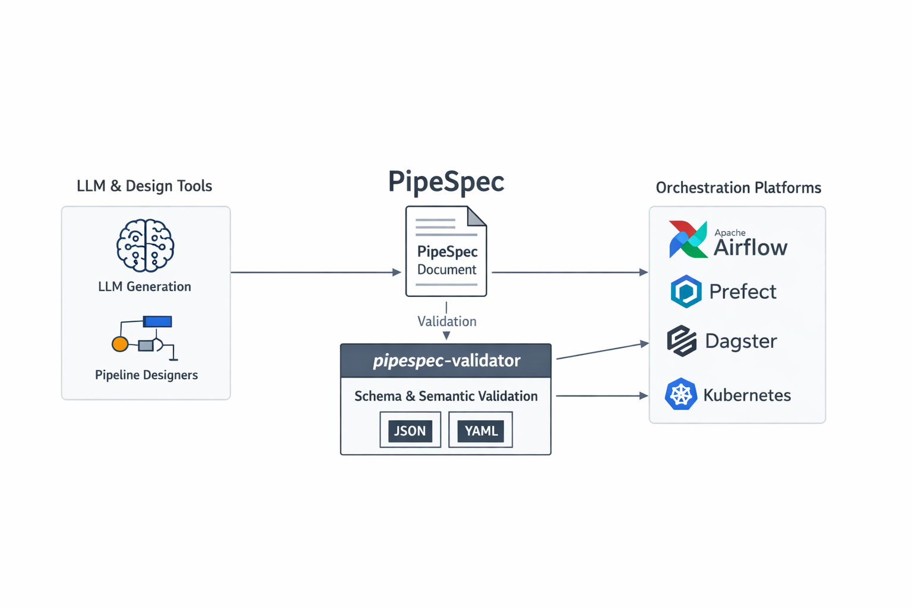

# PipeSpec (v1)

PipeSpec is a platform-agnostic, LLM-friendly extraction format for describing data pipelines as structured documents.



This repository contains:

- The **canonical PipeSpec v1 JSON Schema**: `schema/pipespec_schema_v1.json`
- Example PipeSpec documents: `schema/examples/`
- A Python package + CLI (`pipespec`) to generate/validate/correct PipeSpec documents

## Status

- PipeSpec schema: **v1 (stable)**
- Validator tooling: **v1**

## What PipeSpec is (and isn’t)

PipeSpec captures the *orchestration skeleton*:

- pipeline summary
- components / tasks (category taxonomy, executor types)
- flow topology (nodes + edges)
- structured I/O specs (inputs/outputs)
- parameters and environment-secret *references* (no secret values)
- external integrations catalogue + coarse lineage

PipeSpec does **not** embed business logic payloads (full SQL, Python scripts, etc.).

## JSON vs YAML

PipeSpec v1 is **defined as JSON** (`*.pipespec.json`) validated against JSON Schema Draft-07.

Tooling convenience: the validator also accepts YAML (`*.pipespec.yaml` / `*.yml`) by parsing YAML into a Python dict and validating it against the same schema.

## Using PipeSpec with LLMs (JSON mode)

The validator enforces schema conformance after generation. For generation, you can use:

- **JSON mode** (forces valid JSON syntax)
- **PipeSpec prompt profile** (compact, non-normative helper)
- **Validation + repair loop** (forces conformance)

### Prompt profile

Load the prompt profile programmatically:

```python
from pipespec_validator import load_prompt_profile

# Get the compact prompt profile as a dictionary
profile = load_prompt_profile()
# Use profile in your LLM prompt construction
```

Or reference the raw profile file directly:
```
schema/pipespec_prompt_profile_v1.json
```

### Example repair loop

After LLM generation, validate and repair iteratively:

```python
from pipespec_validator import validate_dict

def generate_with_repair(llm_generator, max_attempts=3):
    """Generate a valid PipeSpec document with repair loop."""
    for attempt in range(max_attempts):
        # Generate with JSON mode enabled
        doc = llm_generator.generate(
            prompt="Generate a PipeSpec document...",
            json_mode=True,
            prompt_profile=load_prompt_profile()
        )
        
        # Validate
        result = validate_dict(doc, semantic_checks=True)
        
        if result.ok:
            return doc
            
        # Feed errors back to LLM for repair
        prompt = f"""Fix these validation errors:
        {result.errors}
        Current document: {doc}
        """
    
    raise Exception(f"Failed to generate valid document after {max_attempts} attempts")
```

## Normative vs. Non-normative artefacts

### Normative (the spec)
- `schema/pipespec_schema_v1.json` is the **only** normative validator schema
- Human-readable docs define semantic requirements (“MUST/SHOULD”), including DAG constraints

### Non-normative (ergonomics)
- `schema/pipespec_prompt_profile_v1.json` is a non-normative helper for LLM generation
- Generated deterministically from the schema
- Packaged for import convenience via `pipespec_validator.load_prompt_profile()`

### Reference tooling
- `pipespec-validate` CLI enforces schema conformance
- Semantic checks (--semantic flag) validate structure (DAG/cycles/etc.) as warnings by default
- Strict mode can be added later if needed

This approach maintains a clean contract:
- **Single source of truth**: canonical JSON Schema
- **Generated artefacts** to reduce drift
- **Explicit non-normative labeling**
- **Stable packaging** for programmatic access

## Install (git)

```bash
python -m pip install "git+https://github.com/<org>/pipespec.git"
```

## Install validator only

```bash
python -m pip install pipespec-validator
```

Or for development:

```bash
python -m pip install -e ".[dev]"
```

## Validate a PipeSpec document

Validate JSON:

```bash
pipespec validate schema/examples/airvisual_pipeline.pipespec.json --semantic
```

Validate YAML (tooling convenience):

```bash
pipespec validate path/to/pipeline.pipespec.yaml --semantic
```

Legacy command (still supported):

```bash
pipespec-validate path/to/pipeline.pipespec.yaml --semantic
```

## Generate a PipeSpec from description text

```bash
pipespec generate \
  --in Pipeline_Description_Dataset/sample.txt \
  --out /tmp/pipeline.pipespec.json \
  --provider openai \
  --model gpt-4o-mini \
  --api-key-env OPENAI_API_KEY
```

Supported providers:
- `openai`
- `claude` (Anthropic)
- `deepinfra`
- `deepseek`
- `openrouter`
- `ollama`
- `openai_compatible`

Check runtime provider defaults and credential detection:

```bash
pipespec providers
pipespec providers --provider openai
pipespec providers --json
```

## Correct an existing PipeSpec

Deterministic structural correction only:

```bash
pipespec correct --in broken.pipespec.yaml --out fixed.pipespec.yaml
```

LLM-assisted correction (uses original description):

```bash
pipespec correct \
  --in broken.pipespec.yaml \
  --out repaired.pipespec.yaml \
  --description Pipeline_Description_Dataset/sample.txt \
  --provider claude \
  --api-key-env ANTHROPIC_API_KEY
```

## Compare two PipeSpecs semantically

```bash
pipespec diff --left run_a.pipespec.yaml --right run_b.pipespec.yaml
pipespec diff --left run_a.pipespec.yaml --right run_b.pipespec.yaml --json
```

Standalone script alias:

```bash
pipespec-diff --left run_a.pipespec.yaml --right run_b.pipespec.yaml --json
```

Exit codes:

- `0` = valid
- `2` = invalid (parse/schema failure)

## Canonical schema

- `schema/pipespec_schema_v1.json` is the normative v1 schema.
- `schema/pipespec_schema.json` is a convenience alias referencing the latest stable version.

For production / research reproducibility, pin to the versioned schema file.

## Development quickstart

```bash
make install
make check-schema-sync
make test
make validate-examples
```

## License

Apache-2.0
